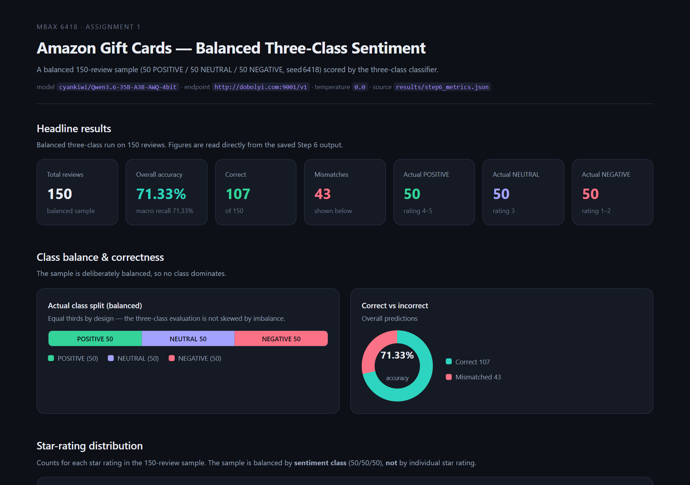
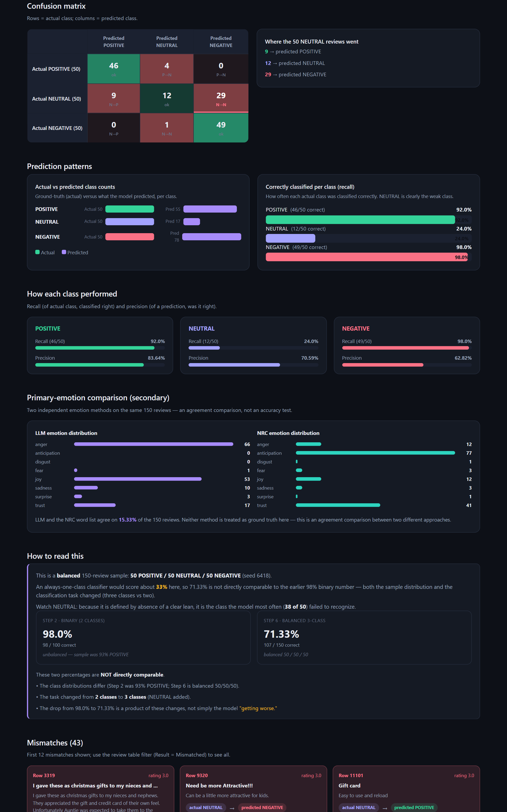

# Amazon Gift Cards — Sentiment & Emotion Classification

**MBAX 6418 · Assignment 1**

A worked end-to-end classification project on Amazon product reviews: a reusable
LLM prompt classifies each review's sentiment (binary and three-class) and primary
emotion, an NRC word-list scores emotions independently, results are evaluated
against star-rating-derived ground truth, and everything is presented in a
self-contained, offline HTML dashboard.

The classification and scoring code is Python. Model calls go through the
OpenAI-compatible course endpoint. Every number in this README comes from a saved
program output under `results/` — nothing quoted here was fabricated.

---

## Table of contents
1. [Overview](#overview)
2. [Repository layout](#repository-layout)
3. [Method](#method)
4. [Results](#results)
5. [Report questions](#report-questions)
6. [Reproducibility](#reproducibility)
7. [Data attribution & licenses](#data-attribution--licenses)
8. [Screenshots](#screenshots)
9. [References](#references)

---

## Overview

The task: build a working review-sentiment classifier for Amazon reviews and a
dashboard to inspect its behaviour. We work through the assignment in order:

1. a **binary** sentiment classifier, validated on the first 100 reviews in file
   order (Step 1–2);
2. a **balanced three-class** experiment with POSITIVE / NEUTRAL / NEGATIVE,
   sampled 50/50/50 from the whole dataset (Step 6);
3. two **independent primary-emotion** methods per review — an LLM judgment and an
   NRC emotion word list (Step 5);
4. a **dashboard** (single self-contained HTML) that presents the balanced
   three-class run, with interactive filtering and descriptive/prediction charts
   (Steps 3–7).

### Data
We use the **Amazon Reviews 2023 "Gift Cards" review category**, part of the
large-scale Amazon Reviews '23 dataset produced by the McAuley Lab at UC San
Diego.

- Dataset page: https://amazon-reviews-2023.github.io
- Review file: `Gift_Cards.jsonl.gz` (gzipped JSON Lines)
- Source: https://mcauleylab.ucsd.edu/public_datasets/data/amazon_2023/raw/review_categories/Gift_Cards.jsonl.gz

The file contains **152,410** review records. The 10 top-level fields observed
(`rating, title, text, verified_purchase, helpful_vote, timestamp, images, asin,
parent_asin, user_id`) all match the documented dataset schema.

---

## Repository layout

```
amazon-reviews-sentiment/
├── README.md
├── .gitignore
├── prompts/                 # reusable prompt artifacts (versioned)
│   ├── sentiment_prompt.txt              # Step 1/2 binary sentiment
│   ├── sentiment_emotion_prompt.txt      # Step 5 binary + primary emotion (JSON)
│   └── sentiment_emotion_3class.txt      # Step 6 three-class + primary emotion (JSON)
├── src/                     # classification, scoring, NRC, dashboard code
│   ├── inspect_gift_cards.py
│   ├── classify.py                      # client, prompt loading, strict parsers
│   ├── spot_check.py                    # Step 1 spot-check
│   ├── score_100.py                     # Step 2 binary scoring (first 100)
│   ├── run_emotion.py                   # Step 5A LLM sentiment+emotion
│   ├── emotion_nrc.py                   # Step 5B NRC word-list emotion
│   ├── compare_emotions.py              # Step 5 comparison
│   ├── sample_balanced.py               # Step 6 balanced sample (seed 6418)
│   ├── run_balanced.py                  # Step 6 three-class LLM + metrics
│   ├── emotion_nrc_balanced.py, compare_emotions_balanced.py
│   ├── build_dashboard.py               # Step 3–4 binary dashboard (historical)
│   ├── build_dashboard_3class.py        # Step 6–7 balanced three-class dashboard
│   └── fetch_nrc_lexicon.py             # downloads the (not-committed) NRC lexicon
├── results/                # saved program output (auditable; raw per-review + metrics)
│   ├── step2_*, step5_*, step6_*        # raw runs, metrics, manifests, comparisons
├── dashboard/              # generated HTML dashboards (self-contained, offline)
│   ├── dashboard.html                   # main balanced three-class dashboard
│   └── step2_binary_dashboard.html      # preserved historical binary dashboard
├── lexicon/
│   ├── LICENSE-NOTICE.md                # NRC attribution + redistribution notice
│   └── (NRC data files are downloaded by src/fetch_nrc_lexicon.py and git-ignored)
└── docs/
    ├── development_notes.md             # bugs & workarounds encountered
    └── images/                          # dashboard screenshots
```

Note: `data/` (the large, re-downloadable review file), `.env`, and the NRC lexicon
data files are **git-ignored** and not committed. Credentials are never stored
anywhere in the repository.

---

## Method

### Model & endpoint
- Model identifier: **`cyankiwi/Qwen3.6-35B-A3B-AWQ-4bit`**
  (discovered from the course endpoint's model list; not guessed).
- API base URL: `http://dobolyi.com:9001/v1` (OpenAI-compatible; the assignment
  endpoint). The base URL is read from `OPENAI_API_BASE`, the key from
  `OPENAI_API_KEY` (env or a git-ignored local `.env`). The key is never printed
  or committed.
- Sampling temperature: `0.0`.

**The model never receives the star rating.** Two prompting rules enforce this:
the prompt is written to judge "only the text provided," and the request payload
contains only the review `title` and `text`. The rating is used strictly as
ground truth for evaluation afterward.

### Binary experiment (Step 1–2)
- A reusable prompt (`prompts/sentiment_prompt.txt`) maps a review's title + body
  to exactly `POSITIVE` or `NEGATIVE`, with documented edge-case rules
  (empty body → judge title alone; conflicting title/body → body dominates;
  balanced/praise-criticism → NEGATIVE in this forced binary setting; ratings
  never shown).
- The **first 100** records in file order are scored (no balancing,
  no randomization, no exclusions).
- **Binary ground truth (Step 2):** rating ≥ 4 → POSITIVE; otherwise NEGATIVE.

### Balanced three-class experiment (Step 6)
- Ground truth from rating: **4–5 → POSITIVE, 3 → NEUTRAL, 1–2 → NEGATIVE**.
- A stratified balanced sample of **150 reviews (50 / 50 / 50)**, drawn
  independently within each class **without replacement**, with a **fixed random
  seed of 6418** (`src/sample_balanced.py`). The full sample is saved in
  `results/step6_manifest.json` (seed, original dataset row/index, rating,
  ground-truth class, title, text) so it is exactly reproducible.
- The three-class prompt (`prompts/sentiment_emotion_3class.txt`) returns strict
  JSON `{"sentiment": "POSITIVE|NEUTRAL|NEGATIVE", "emotion": "<8 emotions>"}`.
  NEUTRAL is defined as genuinely mixed / emotionally neutral / no clear lean — the
  prompt never mentions star ratings or that NEUTRAL "equals 3 stars."

### LLM emotions (Step 5/6)
The same prompt requests, in addition to sentiment, a **single primary emotion**
from exactly: `anger, anticipation, disgust, fear, joy, sadness, surprise, trust`.
All LLM responses are validated by a strict parser (any malformed JSON or
out-of-set label is recorded as a failure, never silently substituted).

### NRC word-list emotions (Step 5/6)
`src/emotion_nrc.py` scores each review's title + body against the
**NRC Emotion Lexicon (EmoLex v0.92, word-level)**: lowercase tokenize on
non-alphabetic characters; +1 to each emotion a matched word is associated with
(association flag = 1); the highest total is the primary emotion. **Tie-break:**
first emotion in the canonical order `[anger, anticipation, disgust, fear, joy,
sadness, surprise, trust]` among the tied maxima (deterministic, flagged per
review). **Zero-match:** if no NRC emotion word matches, the primary falls back to
`trust` and is reported (never hidden). All eight per-review scores are saved for
auditing. The NRC method is independent of the rating, the LLM prediction, and the
LLM emotion. **Neither emotion method is treated as ground truth** — the emotion
comparison is an agreement study.

---

## Results

### Step 2 — binary, first 100 (unbalanced)
| Metric | Value |
|---|---|
| Reviews | 100 |
| Actual POSITIVE / NEGATIVE | 93 / 7 |
| Overall accuracy | **98.0% (98 / 100)** |
| Mismatches | 2 |

Confusion matrix (rows = actual, cols = predicted):

| | pred POSITIVE | pred NEGATIVE |
|---|---|---|
| **actual POSITIVE (93)** | 92 | 1 |
| **actual NEGATIVE (7)** | 1 | 6 |

POSITIVE recall 98.92% · NEGATIVE recall 85.71%. The 2 mismatches: row 18 (5★, the
recipient "loved it" but the attached note was lost → called NEGATIVE) and row 99
(3★, "Very easy to use" → called POSITIVE).

> Caveat: on a 93/7 split an always-POSITIVE baseline scores 93%, so 98% is read
> with the imbalance in mind.

### Step 5 — LLM emotion vs NRC emotion (same first 100)
- **Agree: 25 / 100 (25.0%)**; differ 75 (75.0%).
- LLM distribution: joy 67, trust 24, anger 6, anticipation 2, sadness 1.
- NRC distribution: anticipation 59, joy 21, trust 16, anger 2, disgust 1, sadness 1.
- NRC zero-match: **15** (→ fallback `trust`); ties: 52.
- The new combined Step 5 prompt produced **the same binary sentiment as Step 2
  for all 100** reviews (0 changed), so the emotion addition did not disturb the
  validated Step 2 labels.

### Step 6 — balanced three-class (150, seed 6418)
| Metric | Value |
|---|---|
| Reviews | 150 (50 / 50 / 50) |
| Overall accuracy | **71.33% (107 / 150)** |
| Correct / Incorrect | 107 / 43 |
| Macro recall (= balanced accuracy) | **71.33%** |
| Mismatches | 43 |

Confusion matrix (rows = actual, cols = predicted):

| | pred POSITIVE | pred NEUTRAL | pred NEGATIVE |
|---|---|---|---|
| **actual POSITIVE (50)** | 46 | 4 | 0 |
| **actual NEUTRAL (50)** | 9 | 12 | 29 |
| **actual NEGATIVE (50)** | 0 | 1 | 49 |

Per-class:
| Class | Recall | Precision |
|---|---|---|
| POSITIVE | **92.0%** (46/50) | 83.64% |
| NEUTRAL | **24.0%** (12/50) | 70.59% |
| NEGATIVE | **98.0%** (49/50) | 62.82% |

**Where the 50 NEUTRAL reviews went:** 12 → NEUTRAL, 9 → POSITIVE, **29 → NEGATIVE**.
The dominant error direction is **NEUTRAL → NEGATIVE**.

Star-rating distribution of the balanced sample (note: balanced by *class*, not by
star): **1★ = 44, 2★ = 6, 3★ = 50, 4★ = 3, 5★ = 47** (sum 150).

Predicted class counts vs actual: POSITIVE 55 vs 50, NEUTRAL 17 vs 50, NEGATIVE 78
vs 50 — the model over-predicts NEGATIVE and under-predicts NEUTRAL.

### Step 6 — emotion agreement (balanced 150)
- **Agree: 23 / 150 (15.33%)**; differ 127 (84.67%).
- LLM distribution: anger 66, joy 53, trust 17, sadness 10, surprise 3, fear 1,
  anticipation 0.
- NRC distribution: anticipation 77, trust 41, anger 12, joy 12, fear 3, sadness 3,
  disgust 1, surprise 1.
- NRC ties: **78**; zero-match: **28**.
- Diagnostic agreement on the subset where NRC has a unique, nonzero max
  (n = 44): **7 / 44 = 15.91%** (supplementary; the overall 15.33% remains the
  headline figure).

> Comparing 71.33% here with 98.0% in Step 2 would be apples-to-oranges: the
> distributions differ (93% POSITIVE vs balanced 50/50/50) and the task changed
> from two classes to three (NEUTRAL added). On a balanced sample an
> always-one-class baseline sits near 33%.

---

## Report questions

### 1. Why did the lopsided run look very accurate, and what did balanced sampling change?
The first-100 run was 93% POSITIVE, so an always-POSITIVE baseline already scores
93%; the model's 98% was only 5 correct above that trivial baseline, and the
2 errors were almost invisible against the dominant class. On an **unbalanced**
sample, accuracy mostly measures agreement with the majority class.

Balanced sampling (50/50/50) removes that cover. With the assignment's NEUTRAL as a
third class and equal counts, the model's accuracy fell to **71.33%**, and its
actual weakness became visible: rating-defined NEUTRAL recall collapsed to **24%**
while rating-defined POSITIVE and NEGATIVE stayed at 92% and 98%. What the
imbalanced run hid is that the classifier handles the clear positive and clear
negative classes well, but is poor at the assignment's NEUTRAL class.

### 2. Where do the model's mistakes go (confusion directions)?
Concrete numbers from the Step 6 matrix:
- **ground-truth NEUTRAL → NEGATIVE: 29 / 50** (the dominant error — over half of
  the assignment's NEUTRAL-class reviews are labelled negative).
- **ground-truth NEUTRAL → POSITIVE: 9 / 50**.
- **POSITIVE → NEUTRAL: 4 / 50**.
- **NEGATIVE → NEUTRAL: 1 / 50**.
- Direct **POSITIVE → NEGATIVE** confusion: **0**.
- Direct **NEGATIVE → POSITIVE** confusion: **0**.

Measured behaviour: rating-defined POSITIVE recall is **92%** (46/50),
rating-defined NEUTRAL recall is **24%** (12/50), rating-defined NEGATIVE recall is
**98%** (49/50), and there is essentially no direct POSITIVE↔NEGATIVE error. The
mistakes concentrate on the assignment's NEUTRAL class, which the model most often
pushes toward NEGATIVE.

### 3. How do the LLM's emotions and the word list's emotions differ, and why?
They agree only **25%** (Step 5) / **15.33%** (Step 6). Two independent reasons:
- **Contextual reading vs word sums.** The LLM evaluates the full contextual phrasing,
  tone, and negation ("did not work!!!!" → anger). The NRC word list is independent of
  the LLM: it sums word-level emotion associations (bag-of-words), so it misses
  negation and only sees individual tokens. Because these are gift-card reviews, the
  recurring word "gift" carries *anticipation*+*joy*, so the NRC skews toward
  anticipation (59/77) regardless of tone.
- **Ties and thin text.** On short/terse reviews the NRC produces small equal counts
  (52–78 ties) resolved by an arbitrary canonical order, and 15–28 reviews have no
  matching NRC emotion word at all (fallback `trust`). The LLM, by contrast, weighs the
  whole phrasing rather than a word count, so it lands largely on joy/trust/anger.
  Neither method is "right" — they are different operationalisations of "primary
  emotion."

### 4. What bugs / issues did I hit, and how did I work around them?
The full list is in [`docs/development_notes.md`](docs/development_notes.md). Highlights:
- **Wrong endpoint at the very start of Step 1.** The first spot-check accidentally
  used the local Hermes provider at port **9000**. This was caught before any scored
  experiment: the classifier was switched to the course-required endpoint
  **`http://dobolyi.com:9001/v1`**, **the model identifier was rediscovered there**
  (`cyankiwi/Qwen3.6-35B-A3B-AWQ-4bit`), and Step 1 was re-run through the correct
  endpoint **before** the 100-review Step 2 run ever executed.
- **Empty LLM content on the first emotion run.** Qwen3.6 is a *reasoning* model
  that emits a long thinking field before it answers; an early `max_tokens=60` cap
  was exhausted during reasoning, returning `content=None` for all 100 reviews.
  Removed the cap and the responses completed as clean JSON (`0` failures).
- **Dashboard preview read was a stale snapshot.** After clicking a filter, the
  preview-pane text read still said "100 of 100" even though the DOM had filtered —
  a tool limitation, not a page bug. Verified the shipped page's own script with
  **jsdom** (real `dispatchEvent` clicks) instead: ALL=100→150, CORRECT, MISMATCHED,
  and combined-filter counts all confirmed.
- **Rating filter returned 0 rows.** The balanced ratings are floats (`3.0`), so a
  `data-rating="3.0"` attribute never matched the integer "3" filter button. Fixed
  by storing the integer star value.
- **Comparison field-name mismatch** (balanced LLM row key `llm_emotion` vs the
  comparison's `emotion`) caused an all-zero matrix initially; corrected the field.
- **Python 3.11 f-string nesting** limit in the dashboard generator — worked around
  by precomputing chart HTML strings before the main f-string.

---

## Reproducibility

- **Fixed seed** everywhere sampling occurs: **6418** for the balanced sample.
- **Rating only after prediction** — the model payload is always just title + text.
- **Resumable runs** write results incrementally (`results/*.jsonl`) so an
  interruption loses at most one review.
- **Every reported number is in a saved file** under `results/` (raw per-review
  records, metrics JSON, manifests, comparison outputs). Nothing in this README is
  asserted without checking those files.
- **Model/prompt/endpoint are pinned** in the run metadata JSON files
  (`model`, `api_base_url`, prompt file + sha256, temperature) so a run can be
  replayed exactly.

### Setup the environment
```bash
# 1) Python deps (the project uses standard library mostly; the OpenAI client):
pip install openai

# 2) Credentials (never committed):
#    export OPENAI_API_BASE=http://dobolyi.com:9001/v1
#    export OPENAI_API_KEY=<course key>
#    export SENTIMENT_MODEL=cyankiwi/Qwen3.6-35B-A3B-AWQ-4bit   (or put these in a .env)

# 3) Data (large, re-downloadable, git-ignored):
cd data && curl -LO https://mcauleylab.ucsd.edu/public_datasets/data/amazon_2023/raw/review_categories/Gift_Cards.jsonl.gz

# 4) NRC lexicon (git-ignored; see license notice below):
python src/fetch_nrc_lexicon.py
```

### Re-run the pipeline
```bash
python src/score_100.py                 # Step 2 binary (first 100)
python src/run_emotion.py               # Step 5A LLM emotion
python src/emotion_nrc.py               # Step 5B NRC emotion
python src/compare_emotions.py          # Step 5 comparison
python src/sample_balanced.py           # Step 6 balanced manifest
python src/run_balanced.py              # Step 6 three-class LLM + metrics
python src/emotion_nrc_balanced.py      # Step 6 NRC
python src/compare_emotions_balanced.py # Step 6 emotion comparison
python src/build_dashboard_3class.py    # regenerate the dashboard
```

---

## Data attribution & licenses

### Amazon Reviews '23
> Hou, Yupeng, Jiacheng Li, Zhankui He, An Yan, Xiusi Chen, and Julian McAuley.
> *Bridging Language and Items for Retrieval and Recommendation.* arXiv (2024).
> Dataset: https://amazon-reviews-2023.github.io — Gift Cards category, McAuley Lab,
> UC San Diego. Used under the dataset's research terms.

### NRC Emotion Lexicon
> Mohammad, Saif M., and Peter D. Turney. (2013). *Crowdsourcing a Word-Emotion
> Association Lexicon.* Computational Intelligence 29(3), 524–545.
> https://doi.org/10.1111/j.1467-8640.2012.00460.x — Saif Mohammad, NRC Canada.

**Redistribution note:** the NRC licence ("NRC Sentiment Lexicons Single Product
End-User Licence Agreement", §3.1) states the licensed product **may not be given
access to or disclosed to any other party without NRC's prior written consent**.
Because a (potentially public) GitHub repository counts as disclosing the material,
**the lexicon data file is not committed**. It is downloaded on demand by
`src/fetch_nrc_lexicon.py` from the NRC page and runs the same way. See
[`lexicon/LICENSE-NOTICE.md`](lexicon/LICENSE-NOTICE.md) for details and citation.

---

## Screenshots





The complete page (all sections and the 150-review interactive table) is captured
in [`docs/images/dashboard_full.png`](docs/images/dashboard_full.png). The dashboard
itself is `dashboard/dashboard.html` (open it in any browser; no server needed).
The earlier binary dashboard is preserved at
`dashboard/step2_binary_dashboard.html`.

---

## References
- Amazon Reviews 2023: https://amazon-reviews-2023.github.io
- Gift Cards review file: https://mcauleylab.ucsd.edu/public_datasets/data/amazon_2023/raw/review_categories/Gift_Cards.jsonl.gz
- NRC Emotion Lexicon: https://saifmohammad.com/WebPages/NRC-Emotion-Lexicon.htm
- Mohammad & Turney (2013): https://doi.org/10.1111/j.1467-8640.2012.00460.x
